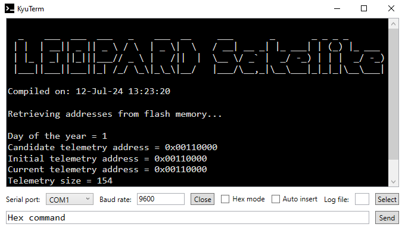

# KyuTerm

A minimalist serial terminal application designed for debugging small satellites and embedded systems.

## Overview

KyuTerm was originally created as a learning project while studying C#, but has evolved into a practical tool widely used by students at Kyutech (Kyushu Institute of Technology) due to its simplicity and focused functionality. The application provides essential serial communication features without unnecessary complexity.



## Features

- **Serial Communication**: Connect to any available COM port with configurable baud rates
- **Automatic Port Detection**: Automatically discovers and lists available serial ports
- **Dual Display Modes**: Toggle between ASCII and raw hexadecimal output
- **Command Input**: Send commands in plain text or hexadecimal format
- **Text Logging**: Save all terminal output to disk with automatic timestamping
- **Clipboard Integration**: Automatically monitor and insert hex commands from clipboard
- **Timestamped Logs**: Prepend date/time to each new line in log output for better debugging
- **Minimalist Interface**: Clean, distraction-free terminal interface with Consolas font

## Use Cases

- Debugging small satellites and CubeSats
- Embedded systems development and testing
- Serial device communication and monitoring
- Educational projects requiring serial interface
- Quick serial port testing and validation

## Requirements

- Windows operating system
- .NET Framework 4.8 or later
- Available serial/COM ports

## Installation

1. Download the latest release from the releases page
2. Extract the files to your desired location
3. Run `KyuTerm.exe`

## Building from Source

### Prerequisites

- Visual Studio 2022 or later
- .NET Framework 4.8.1 SDK

### Build Steps

1. Clone the repository:
   ```bash
   git clone https://github.com/schulz89/KyuTerm.git
   ```

2. Open `KyuTerm.sln` in Visual Studio

3. Build the solution (Ctrl+Shift+B)

4. The executable will be available in `bin/Debug` or `bin/Release`

## Usage

1. **Connect to Device**:
   - Select your COM port from the dropdown
   - Set the appropriate baud rate (default: 9600)
   - Click "Open" to establish connection

2. **Send Commands**:
   - Type commands in the input field at the bottom
   - Press Enter or click "Send" to transmit

3. **View Output**:
   - All received data appears in the main terminal window
   - Toggle between ASCII and hex display modes
   - Use "Auto insert" for automatic clipboard command insertion

4. **Logging**:
   - Click "Select" to choose a log file location
   - All output is automatically saved with timestamps

## Contributing

Contributions are welcome in the form of pull requests or feature suggestions!

## License

This software is licensed under the **GNU GPL version 2.0**. See [LICENSE](LICENSE) for details.

## Acknowledgments

Special thanks to the students at Kyutech who have provided feedback and continue to use this tool in their research and development work.
